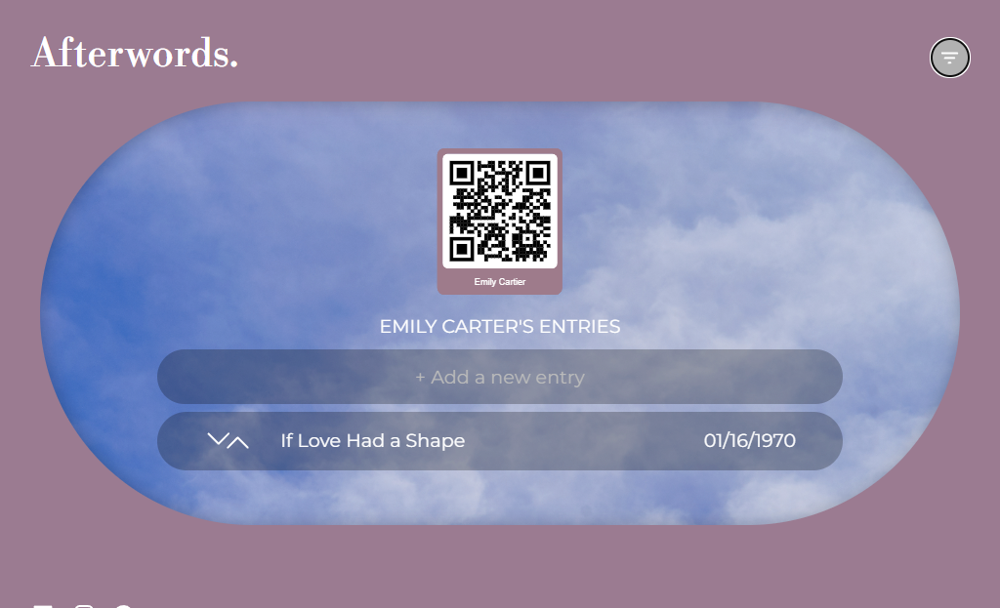

# Afterwords.

## Overview

The app allows users to create notes or journal entries for their loved ones, meant for them to have access to after they pass away.
The aim is to provide them the type of intimate comfort and support they can only get from them during the early stages of grief.
To encourage healthy coping, the user will have a limit of 31 entries, providing a meaningful yet balanced way to stay connected without turning into a coping mechanism.

### Problem Space

Passing away and grief are deeply personal experiences, yet they are often left unspoken due to their intimate nature.
So I was curious about ways I can use technology in bridging that gap, while respecting the privacy of those who experience it,
and it got me thinking, how can we create ways to support our loved ones even after we're gone?

### User Profile

The app is designed for two or more users at different points in time: the primary user (who initiates the experience), and the secondary user(s) (their loved ones) who access it later.
The primary user creates up to 31 entries per person over time and shares a unique identifier code (UIC) with their loved ones.
After a lifetime of cherished moments, the secondary user(s) can retrieve these messages using the UIC linked to their entries.

At this stage, the app relies on long-term trust and safekeeping, ensuring that entries are accessed only when the time is right.
However, recognizing the extended period before use for the secondary user(s), the app also aims to explore additional authentication methods in case of UIC loss.

### Features

User registration and setup
Entry creation
Entry management
Secure text storage and access
Trust and authentication

All the above are future features. The app is at the prototype stage currently.
The app runs locally with a mock login system

### Tech Stack

Frontend:
⌛ React
⌛ SASS

Backend:
⌛ Node
⌛ Express
⌛ MySQL
⏳ JSON Web Token (JWT) - for authenticating users
⏳ bcrypt

Storage/Security:
⏳ Firebase - authentication instead of JWT? if there's time
⏳ AES-256 - encryption of data if there's time
⏳ UUID - creating unique ids for data and users' loved ones entries

### APIs

⌛ Axios
⌛ Express.js - server environment
⌛ Knex

⏳ JWT - authenticating users
⏳ Firebase - authenticating and storing data instead of mySQL?

### Sitemap

⌛ Homepage - (user login, code access, about section, how-to section)
⌛ Logged in - add loved one, create/read/update/delete user/loved ones/entries, as well as reorder entries
⏳ Loved One Access - code entry to view linked entries

### Mockups

#### Home Page Initial Design Exploration


#### About Page


#### Login Page


#### Desktop with Drawer Open


#### Add Loved One/Entry Page





### Data

Data is managed by MySQL where 3 tables are created:
authors - has author_id
loved ones - linked to foreign key of author_id
entries - linked to foreign keys of author_id and loved_one_id

### Endpoints

Primary User - The Author
**GET /** - Homepage
**GET /about** - About page
**GET /how-to** - How To page
**POST /register** - Register page ⏳
**GET /login** - Login page

**authors section - "/authors"**
**GET /authors/:id** - Get author's data - Created only on the backend side ⏳
**POST /authors/add-new** - Add a new author - Created only on the backend side ⏳
**PUT /authors/:id** - Update author's data - Created only on the backend side ⏳
**DELETE /authors/:id** Created only on the backend side ⏳

**loved ones section - "/lovedOnes"**
**POST /loved-ones/:id/all** - Get all author's loved ones - Created only on the backend side ⏳
**GET /loved-ones/:id/loved-one/:lovedOneId** - Get a loved one
**POST /loved-ones/:id/add-new** - Add a new loved one
**PUT /loved-ones/:id/loved-ones/:lovedOneId** - Update a loved one - Created only on the backend side ⏳
**DELETE /loved-ones/:id/loved-one/:lovedOneId** - Delete a loved one - Created only on the backend side ⏳

**entries section - "/entries**
**GET /:id/:lovedOneId/entries** - Get all loved one's entries - Created only on the backend side ⏳
**POST /entries/:id/:lovedOneId/entry/add-new** - Add a new entry - Created only on the backend side ⏳
**GET /entries/:id/:lovedOneId/entry/:entryId** - Get an entry
**PUT /entries/:id/:lovedOneId/entry/:entryId** - Update an entry - Created only on the backend side ⏳
**DELETE /entries/:id/:lovedOneId/entry/:entryId** - Delete an entry - Created only on the backend side ⏳

**GET /about**

- fetch the about component to learn more about the platform

**GET /how-to**

- fetch the how to component to understand how the platform works

**GET /user**

- log in to fetch user data saved with loved ones list and entries

Response:

```
[
    {
        "email": "duhaemousa@gmail.com",
        "password": "@tchoBlessYou",
    },
    ...
]
```

**GET /loved-one/:id/entries**

- fetch a specific loved one and their data

Response:

```
[
    {
        "id": 1,
        "email": "duhaemousa@gmail.com",
        "lovedOne": "Tony",
        "loved-one_id": 1,
        "entries": [
    "Hey there love, I just thought of when we went on our first date. I cannot believe it has been 20 years, and I get to wake up to your beautiful face today. I feel so blessed and I want you to know I cherish your presence and laughter. You warm my heart so much, and my life feels and smells the best, even with your farts. I love you to all my bits and yours",
    "Travelling without you sucks. I miss holding you at night. Surprisingly, it feels too quiet without you snoring here. I hope you are warm and the kiddos are having a blast at the camp! Counting the days till I get home and hold you all my love. Four more... Happy Valentine's Day babes",
  ],
    },
    ...
]
```

**GET /loved-one/:id/entry/:id**

- fetch a specific loved one and a specific entry

Response:

```
[
    {
        "id": 1,
        "email": "duhaemousa@gmail.com",
        "lovedOne": "Tony",
        "entries": [
    "Hey there love, I just thought of when we went on our first date. I cannot believe it has been 20 years, and I get to wake up to your beautiful face today. I feel so blessed and I want you to know I cherish your presence and laughter. You warm my heart so much, and my life feels and smells the best, even with your farts. I love you to all my bits and yours",
    "Travelling without you sucks. I miss holding you at night. Surprisingly, it feels too quiet without you snoring here. I hope you are warm and the kiddos are having a blast at the camp! Counting the days till I get home and hold you all my love. Four more... Happy Valentine's Day babes",
  ],
    },
    ...
]
```

**POST /register**

- create a new primary user account

Response:

```
[
    {
        "id": 1,
        "email": "duhaemousa@gmail.com",
        "password": "@tchoBlessYou",
        "confirmPassword": "@tchoBlessYou",
    },
    ...
]
```

**POST /login**

- login to user account

Response:

```
[
    {
        "email": "duhaemousa@gmail.com",
        "password": "@tchoBlessYou",
    },
    ...
]
```

**POST /user/create-loved-one**

- create a new loved one profile + a UCI

Response:

```
[
    {
        "loved_one_id": "Tony",
        "": "a7e0ee39-dc18-4f6b-8d69-d6770f8835f7",
    },
    ...
]
```

**POST /loved-one-entry**

- create a new entry for a specific loved one

Response:

```
[
    {
        "loved_one_name": "Tony",
        "title": "Hello my love",
        "content": "Find us where we are stumbling west. As always, we find each other with eyes closed along with the wind that blows us in all directions. I invite you to explore again"
    },
    ...
]
```

**PUT /loved-one-entry/:id**

- update a specific loved one's entry

Response:

```
[
    {
        "loved_one_name": "Tony",
        "title": "Hello my love",
        "content": "Find us where we are stumbling west. As always, we find each other with eyes closed along with the wind that blows us in all directions",
    },
    ...
]
```

## Roadmap

- Create client

  - react project with routes and boilerplate pages

- Create server

  - express project with routing, with placeholder 200 responses

- Deploy client and server projects so all commits will be reflected in production

- Feature: Home page

- Feature: About page

  - Implement register page + form
  - Create GET /about endpoint

- Feature: How To page

  - Implement how to page
  - Create GET /howTo endpoint

- Feature: Add a Loved One

  - Implement add loved one page
  - Store given name and UCI in the backend
  - Create GET /addLovedOne/ endpoint

- Feature: Add an Entry to Loved One

  - Implement view loved ones page
  - Create GET /lovedOne/:id/entry/:id

- Feature: Login to account

  - Implement login page + form
  - Create POST /users/login endpoint

- DEMO DAY

## Future Implementations

- Feature: Register/login with an account

  - Implement registeration page with authentication
  - Create POST /users/register endpoint

- Feature: Implement JWT tokens
  - Server: Update expected requests / responses on protected endpoints
  - Client: Store JWT in local storage, include JWT on axios calls

# duha-wall-afterwords-proposal
